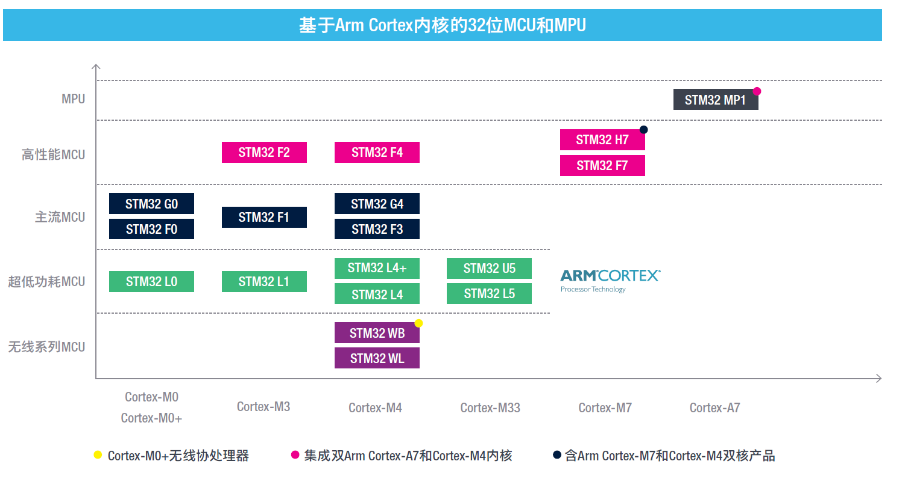

# 摘要

# Abstract

# 目录

[TOC]

# 1 绪论

# 2 Autobot机器人的结构设计

## 2.1 机器人底盘设计

# 3 Autobot机器人的硬件设计

## 3.1 主要控制系统选型

### 3.1.1 上位机主控选型

上位机作为机器人的大脑，承担机器人最复杂的计算任务，如建图、导航、人体姿态估计等。所以对上位机型号的选择尤为重要，它决定能否自如的完成机器人的计算任务。另外，在机器人设计时不仅要考虑当前功能的需要，还要留有一定计算冗余，便于后期增强神经网络算法深度，用于实现更复杂的功能。常用上位机主控有树莓派、JetsonNano、JetsonTX2、miniPC等，下表选择了其中具有代表性的几款产品进行对比：

| 型号名称 | [Raspberry Pi 4B](https://www.waveshare.net/shop/Raspberry-Pi-4-Model-B-4GB-RAM.htm) | [Jetson TX2](https://www.leadtek.com.cn/chs/products/ai_hpc(37)/nvidia_jetson_tx2(10782)/detail) |                     Jetson Nano                     | [Intel-i5-6300HQ miniPC](https://ark.intel.com/content/www/cn/zh/ark/products/88959/intel-core-i56300hq-processor-6m-cache-up-to-3-20-ghz.html) |
| :------: | :----------------------------------------------------------: | :----------------------------------------------------------: | :-------------------------------------------------: | :----------------------------------------------------------: |
|   CPU    |             1.5GHz 四核 64 位 ARM Cortex-A72 CPU             |    HMP Dual Denver 2/2 MB L2 + Quad ARM® A57/2 MB L2    |                 四核 ARM Cortex A57                 | 2.3GHz 四核Intel-i5 CPU 最大睿频频率：3.2GHz 缓存：6MB Intel Smart Cache 散热设计功耗（TDP）：45W |
|   GPU    |                 Broadcom VideoCore IV@500MHz                 |                NVIDIA Pascal™，256 CUDA 核心                 |                  128 Maxwell cores                  | [‎NvidiaN16P-GX(GTX960M), VRAM 4G GDDR5](https://www.nvidia.cn/geforce/gaming-laptops/geforce-gtx-960m/specifications/) |
|   内存   |                       2GB/4GB/8GB 可选                       |                      8GB 128bit LPDDR4                       |                  4GB 64bit LPDDR4                   |                        8GB DDR4-2133                         |
|   USB    |                   2 x USB2.0 + 2 x USB3.0                    |                   1 x USB2.0 + 1 x USB3.0                    |               1 x USB2.0 + 4 x USB3.0               |                   2 x USB2.0 + 2 x USB3.0                    |
|   WiFi   |               802.11 b/g/n/ac 2.4GHz/5GHz双频                |                    802.11 2x2 ac/BT Ready                    |                  M.2 Key E扩展WiFi                  |                          802.11bgn                           |
|   功耗   |                             15W                              |                            ≤7.5W                             |                        5-10W                        |            65W(UMA model) 120W (Nvidia GPU model)            |
|   备注   |                                                              | https://www.leiphone.com/category/ai/TEpCLJfL6ni05AJZ.html https://www.jetsonhacks.com/2017/03/14/nvidia-jetson-tx2-development-kit/ | https://developer.nvidia.cn/zh-cn/cuda-gpus#compute | https://www.amazon.co.jp/Support-Windows-Computer-I5-Partaker/dp/B075CXB129 |

如上表所述，树莓派虽功耗较低，但其整体性能有限，对于同时部署SLAM算法与人体姿态估计的神经网络算法来说，略显不足。Jetson系列是NVIDIA公司推出的嵌入式人工智能超级计算平台，在思科的电视电话会议系统、法拉赫的工厂自动化等都采用了Jetson系列计算平台。JetsonNano的四核A57CPU性能较为一般，与JetsonTX2的Denver核心要差不少。JetsonTX2的CPU相较于Intel Core系列的I5-3XXXU计算性能大致相当，所以相较于i5-6300HQ的miniPC还要差一些。

本人在使用JetsonTX2时，ARM架构下的部分功能包与工具稍有不足。在计算平台使用神经网络进行实验时，会用到较多不同深度学习框架，如Tensorflow、Pytorch等，其对系统环境的依赖有严格的要求，所以我们在实验时会使用Anaconda创建多个不同虚拟环境，用于支撑不同算法的运行。但Anaconda并不支持ARM架构，有着类似功能的miniconda、Archiconda等对程序功能包的支持却不如Anaconda。所以在实际使用中，Intel i5的miniPC更为便利。

所以考虑主控性能与实际使用，miniPC应为首选。但其额外突出的功耗却是十分值得考虑的问题。对于普通的实验平台，整体框架较小，驱动能力与承载能力有限，所以更加青睐高性能低功耗的计算平台。但本机器人的设计为实用平台，而非实验平台，其驱动能力与承载能力足以支撑miniPC的功耗。

综上所述，本机器人的主控型号选择，确定为搭载GTX960M的Intel-i5-6300HQ miniPC。

### 3.1.1 下位机主控选型

下位机主要用于控制电机、读取传感器数据、与上位机通讯等功能。由于SLAM算法中的导航算法大多基于概率模型，加上计算速率与传输速率的影响，仅仅依靠上位机很难实现实时性特别高的功能。尽管机器人设计的目标为低速移动机器人，出于安全考虑，机器人也要有多重安全防护措施。所以上位机SLAM算法的避障处理作为第一重防护，下位机直接读取的测距模块或雷达的距离信息作为第二重防护，为避免电信号受磁场、短路、断路等影响，在机器人机身布置防撞条作为机器人的第三重防护。所以下位机要尽量准确、快速的读取传感器信息，灵活、精准的实现通讯功能。

较为常用的下位机主控有STC51、MSP430、Arduino、STM32、飞思卡尔等。MSP430系列资料较少、飞思卡尔价格较高、STC51与Arduino的性能较STM32相差较多，ST公司推出的STM32CubeMX、CubeMonitor、X-CUBE-AI等为STM32的开发提供了极大便利。所以下位机主控确定在STM32单片机系列。

综合考虑前文说明的下位机主控要求，将主控型号的锁定在主流MCU和高性能MCU之间。下面选择两类中具有代表性的两款同配置单片机进行对比。

|      单片机型号       | STM32F103VGT6 | STM32F407VGT6 |
| :-------------------: | :-----------: | :-----------: |
|    Frequency(MHz)     |      72       |      168      |
|         Core          |   Cortex-M3   |   Cortex-M4   |
|          I2C          |       2       |       3       |
|          CAN          |       1       |       2       |
| USB OTG_HS/USB OTG_FS |       0       |      1/1      |
|       Ethernet        |       0       |       1       |
|        U(S)ART        |      3+2      |      4+2      |

如上表所述，STM32F4系列主控频率更高，处理性能更强。我们常用的OLED、IMU等大多要用到I2C或USART通信，所以从通信接口看，STM32F4系列更胜一筹。STM32与ROS间使用串口通信时，需要借用USB-TTL电路实现，本人在魔方机器人的设计中使用USB-TTL模块通信时，常遇到信号不稳定与信号乱码情况，所以在本机器人的设计中使用VCP虚拟串口实现，这依赖于单片机的USB OTG_HS/USB OTG_FS。为使机器人配置更加灵活，机器人上位机与下位机还可使用Ethernet通信，所以选定STM32F4系列单片机。

在下位机的程序设计中，传感器数据读取、OLED显示、通讯、APP等互有交流，但运行互不影响，所以使用嵌入式操作系统将这几个功能分别置于不同线程运行，能更大效率利用单片机性能。使用实时操作系统依赖于较大FLASH。

综上，考虑运行性能、FLASH大小、读取传感器占用引脚等因素，选定LQFP100封装的STM32F407VGT6作为下位机主控。

## 3.2 电机驱动电路设计

## 3.3 传感器选型

### 3.3.1 IMU

### 3.3.2 激光雷达

### 3.3.3 深度相机

### 3.3.4 雷达与测距模块

## 3.4 电源电路设计

## 3.5 本章小结

# 4 Autobot机器人的软件设计

##  4.1 机器人下位机软件设计

### 4.1.1 基于FreeRTOS操作系统的程序框架设计

### 4.1.2 基于DMA的ADC数据读取程序设计

### 4.1.3 基于VCP的模拟串口通讯设计

### 4.1.4 基于rosserial的下位机ROS通讯设计

## 4.2 机器人上位机软件设计

### 4.2.1 基于rosserial的上位机ROS通讯设计

### 4.2.2 基于机器人实体模型的TF分析

### 4.2.3 基于RIVZ的机器人传感器数据显示

### 4.2.4 基于话题通讯的机器控制程序设计

## 4.3 本章小结

# 5 人机交互系统设计

## 5.1 基于PyQt5的控制APP设计

### 5.1.1 控制界面功能总览

### 5.1.2 基于matplotlib的传感器数据图形化显示设计

## 5.2 基于stm32的网络遥控设计

### 5.2.1 遥控设计概述

### 5.2.2 OLED的GUI界面设计

### 5.2.3 局域网内stm32与ROS系统的通信系统设计

## 5.3 基于Web的网页控制界面设计

## 5.4 本章小结

# 6 SLAM算法分析与实践

## 6.1 SLAM概述

## 6.2 Gmapping算法实现

## 6.3 Cartographer算法实现

# 7 人体姿态估计系统设计

## 7.1 人体姿态估计概述

## 7.2 自适应多视图融合人体姿态估计算法实现

## 7.3 本章小结

# 8 总结与展望

# 参考文献

# 致谢

