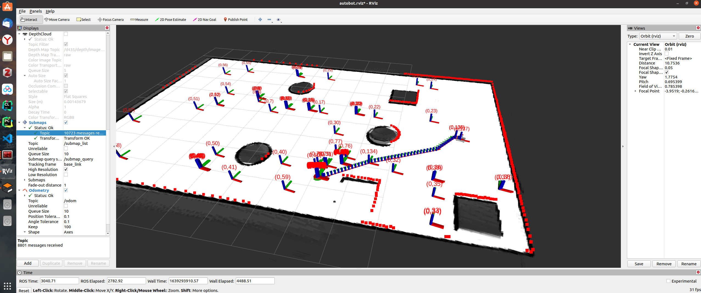

# Autobot

# 更新日志
+ 2021-12-14
  + git
    + 增加submodule使用

+ 2021-12-13
  + GUI
    + 增加虚拟摇杆
    + 显示虚拟摇杆发送的数值
  + HumanPose Estimation
    + [更新Adafuse摘要](https://readpaper.com/paper/3104343368)
    + [更新lightOpenpose摘要](https://readpaper.com/paper/2963265461)
  + 

+ 2021-12-12
  + SLAM
    + [使用cartographer创建地图](http://zhangguixin.top/2021/12/12/ROS/cartographer安装与使用/)
  + HumanPose Estimation
    + 精读Adafuse
    + 精读lightOpenpose
  + 

+ 2021-12-06
  + simulation
    + 增加RealsenseD435的仿真模型
    + 增加KinectV2的仿真模型

+ 2021-12-02
  + stm32
    + [使用自定义消息实现stm32与ROS通信](http://zhangguixin.top/2021/11/16/ROS/使用自定义消息实现ROS与stm32通讯/)
    + 实现IMU数据控制仿真环境下autobot运动控制
  + + 

+ 2021-11-20
  + simulation
    + 通过sw2urdf导出模型
    + [控制导出模型在Gazebo中的运动](http://zhangguixin.top/2021/11/20/ROS/控制sw2urdf导出模型在Rviz和Gazebo中运动/)
    + Rviz同步显示数据
  